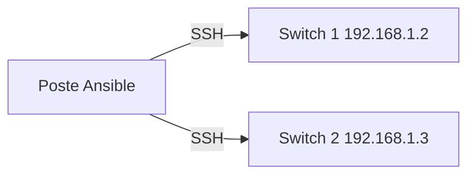

# Lab automatisation : configurer des équipements Cisco avec Ansible

> **Statut : à réaliser.** Ce guide est préparé à partir de la documentation officielle et de mes cours ; **je ne l'ai pas encore rejoué de bout en bout**. Les commandes sont à valider en le faisant, et le journal en bas de page sera complété avec mes résultats réels (captures, erreurs rencontrées, corrections).
>
> **Commandes vérifiées :** ce guide a été rejoué le 22 septembre 2026 avec le vrai Ansible : les collections `cisco.ios` et `ansible.netcommon` s'installent, l'inventaire est valide, `ansible-playbook --syntax-check` passe, et les paramètres utilisés (`ios_vlans.config.vlan_id`/`name`, `state: merged`, `ios_config.backup_options.dir_path`) existent bien dans les modules installés (vérifié avec `ansible-doc`). Sans switch réel, l'exécution s'arrête proprement sur un délai de connexion, comme attendu. Vérifié ne veut pas dire réalisé : c'est l'assistant IA qui a préparé ce guide qui a rejoué ces commandes dans un conteneur jetable, pas moi sur mon propre lab. Le journal ci-dessous reste à remplir une fois que je l'aurai fait moi-même.

## Objectif

Configurer des équipements **automatiquement** plutôt qu'à la main : décrire l'état voulu (VLAN, sauvegarde de configuration) dans un fichier, et laisser **Ansible** l'appliquer à un ou plusieurs équipements Cisco en SSH — sans agent à installer sur les équipements.

## Prérequis

- Un poste de contrôle **Linux** (Debian 12 ou WSL) avec Python 3 et **Ansible**.
- Un équipement Cisco IOS accessible en **SSH** : matériel réel, IOSv/CSR sous GNS3 ou CML. (Packet Tracer n'est pas adapté : il n'offre pas de vrai serveur SSH pilotable depuis l'extérieur.)
- Sur l'équipement : SSH activé et un compte avec le niveau de privilège 15.

## Topologie



## Étapes

### 1. Installer Ansible et la collection Cisco

```bash
python3 -m venv ~/ansible-venv && . ~/ansible-venv/bin/activate
pip install ansible paramiko
ansible-galaxy collection install cisco.ios ansible.netcommon
```

### 2. Décrire l'inventaire

Fichier du dépôt : [`inventaire.ini`](inventaire.ini)

```ini
[switches]
sw1 ansible_host=192.168.1.2
sw2 ansible_host=192.168.1.3

[switches:vars]
ansible_network_os=cisco.ios.ios
ansible_connection=ansible.netcommon.network_cli
ansible_user=admin
```

Le mot de passe ne s'écrit **pas** dans le fichier. Il se demande au lancement (`--ask-pass`) ou se chiffre avec **Ansible Vault** :

```bash
ansible-vault encrypt_string 'le-mot-de-passe' --name ansible_password
```

et se colle ensuite dans `[switches:vars]`. Ne jamais publier un mot de passe, même de labo, dans un dépôt.

### 3. Écrire le playbook

Fichier du dépôt : [`vlans.yml`](vlans.yml)

```yaml
---
- name: Configurer les VLAN et sauvegarder la configuration
  hosts: switches
  gather_facts: false

  tasks:
    - name: Créer les VLAN
      cisco.ios.ios_vlans:
        config:
          - vlan_id: 10
            name: POSTES
          - vlan_id: 20
            name: SERVEURS
        state: merged

    - name: Sauvegarder la configuration en cours
      cisco.ios.ios_config:
        backup: true
        backup_options:
          dir_path: ./sauvegardes
```

`state: merged` ajoute ou met à jour les VLAN listés sans toucher aux autres. Le playbook est **idempotent** : le relancer sans changement ne modifie rien.

### 4. Exécuter : d'abord à blanc

```bash
ansible switches -i inventaire.ini -m ansible.netcommon.net_ping --ask-pass       # test de connexion
ansible-playbook -i inventaire.ini vlans.yml --ask-pass --check --diff            # simulation
ansible-playbook -i inventaire.ini vlans.yml --ask-pass                           # application réelle
```

## Vérifications

- La simulation `--check --diff` affiche les VLAN à créer, puis l'exécution réelle indique `changed`.
- Une **seconde exécution** affiche `ok` et `changed=0` : c'est la preuve de l'idempotence.
- Sur le switch : `show vlan brief` liste `POSTES` et `SERVEURS`.
- Le dossier `sauvegardes/` contient un fichier de configuration par équipement (à **ne pas publier** : il contient des secrets, voir le `.gitignore`).

## Pièges fréquents

- `ansible_network_os` ou `ansible_connection` manquants : Ansible tente une connexion SSH « Linux » et échoue.
- Clé d'hôte SSH inconnue : accepter la première connexion à la main (`ssh admin@192.168.1.2`), ou renseigner `known_hosts`.
- Algorithmes SSH anciens sur du matériel vieux : erreur de négociation `no matching key exchange method`.
- Compte sans privilège 15 : les tâches de configuration échouent.
- Espacement YAML incorrect : YAML utilise des espaces, jamais de tabulations.

## Pour aller plus loin

- Gérer aussi les interfaces (`cisco.ios.ios_interfaces`, `ios_l2_interfaces`) et les ACL.
- Utiliser des **modèles Jinja2** pour générer les configurations de plusieurs équipements.
- Lancer les playbooks depuis un dépôt Git avec un contrôle automatique (`ansible-lint`).
- S'entraîner sans matériel avec des équipements virtuels conteneurisés : voir le dépôt forké *containerlab* de mon profil.

## Références

- [Collection cisco.ios](https://docs.ansible.com/ansible/latest/collections/cisco/ios/index.html)

## Journal de réalisation

_Lab pas encore réalisé : cette section sera remplie au fur et à mesure._

| Date | Ce que j'ai fait | Résultat | Difficultés et solutions |
|---|---|---|---|
|  |  |  |  |

## Feuille de route

Ce lab fait partie de ma [feuille de route réseau](https://github.com/mehdiseg/roadmap-reseau-bts-sio).
